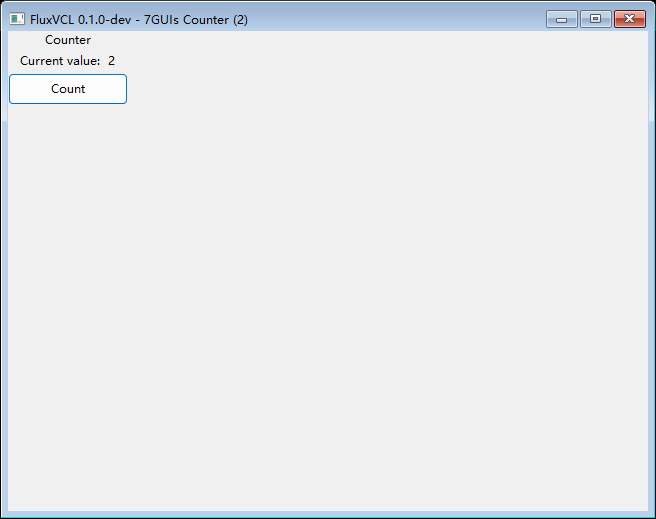
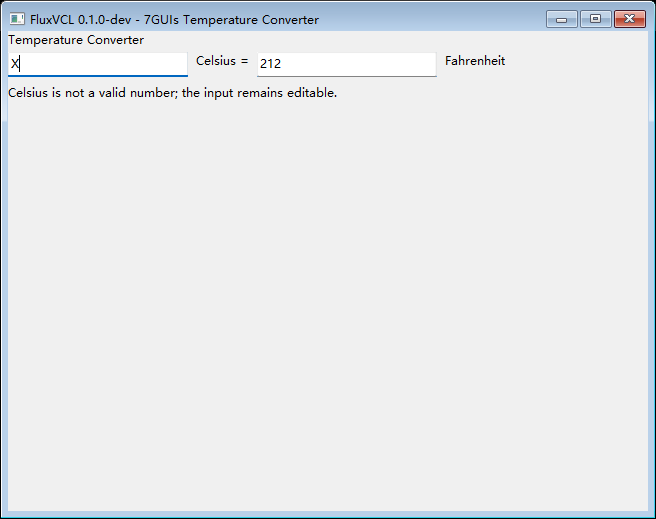
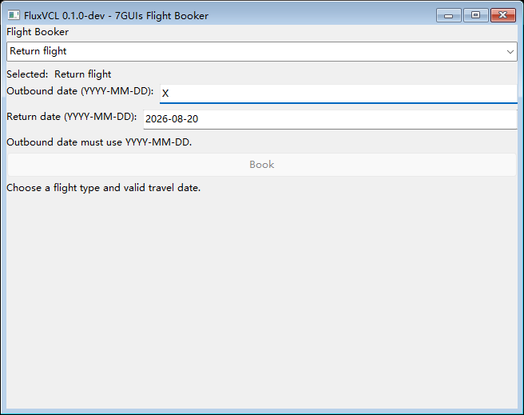
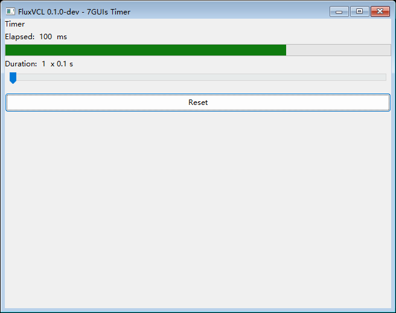
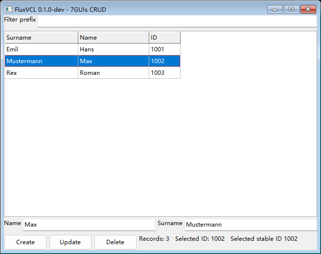
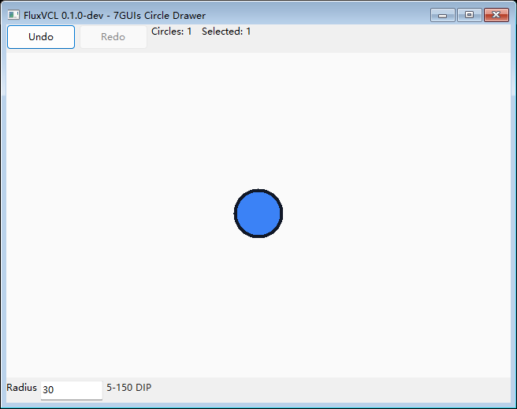
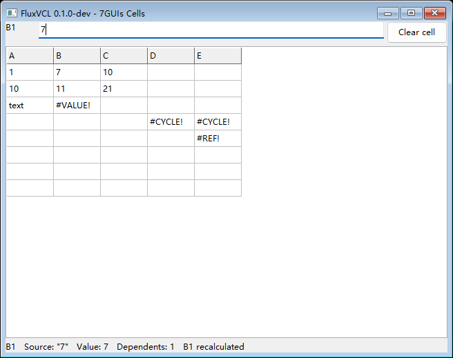

# 7GUIs 任务映射 / 7GUIs Task Map

本页把每个 7GUIs 任务映射到 FluxVCL 的公开 API。示例使用真实控件和
真实状态，不用静态截图或 `Native` 逃逸口替代缺失机制。每个目录都可独立
用 `scripts/build.ps1 -Target <target>` 构建。

| 任务 | 目标 | 控件/机制 | 业务层边界 | 真实窗口 |
|---|---|---|---|---|
| Counter | `7guis-counter` | `State`, `Text`, `Button` | 计数器状态 | [截图](screenshots/7guis-counter.png) |
| Temperature Converter | `7guis-temperature-converter` | `Input`, 文本转换 | 非法输入保持可编辑 | [截图](screenshots/7guis-temperature-converter.png) |
| Flight Booker | `7guis-flight-booker` | `ComboBox`, `Input`, `Enabled` | 日期字符串校验 | [截图](screenshots/7guis-flight-booker.png) |
| Timer | `7guis-timer` | `Animation`, `ProgressBar`, `Slider` | 时间和持续时间状态 | [截图](screenshots/7guis-timer.png) |
| CRUD | `7guis-crud` | `StringGrid`, `Input`, 选择/编辑事件 | 内存中的人员模型 | [截图](screenshots/7guis-crud.png) |
| Circle Drawer | `7guis-circle-drawer` | `PaintBox`, DIP 鼠标事件 | 圆列表、选择、撤销/重做 | [截图](screenshots/7guis-circle-drawer.png) |
| Cells | `7guis-cells` | `StringGrid`, 公式依赖 | 示例级公式解析，不进入控件 API | [截图](screenshots/7guis-cells.png) |

## 真实运行截图 / Runtime screenshots

以下图片由 `scripts/smoke.ps1` 在真实 Windows 窗口完成业务交互后捕获，并已通过
非黑像素与亮度范围检查。

| Counter | Temperature Converter |
|---|---|
|  |  |
| Flight Booker | Timer |
|  |  |
| CRUD | Circle Drawer |
|  |  |
| Cells | |
|  | |

## 交互和 smoke

每个示例的 smoke 都定位真实业务控件：Counter 点击 `Count` 并比较计数文本，
Temperature Converter 写入摄氏输入并验证华氏换算，Flight Booker 切换航班类型
并验证 `Book`/返程日期启用状态，Timer 驱动 Slider 键盘回写后验证进度，CRUD/Cells
验证原生表格选择（Cells 另验证原位编辑），Circle Drawer 验证 PaintBox 绘制及
Undo/Redo。现有基础示例仍使用唯一数字按钮的通用 smoke；7GUIs 不插入测试专用
控件。截图由 Windows `PrintWindow`/屏幕回退生成并做像素有效性检查。手工验收还要
确认键盘、中文输入法、选择、编辑、鼠标命中和关闭窗口没有异常。

上表截图由对应业务 smoke 在真实 Windows 窗口完成交互断言后生成，保留的是
验证后的任务状态，不是静态 mock 或预生成界面。

## 7GUIs task map (English)

The seven targets above are intentionally small. StringGrid owns only a bounded,
defensive-copying string matrix and controlled selection/edit callbacks. PaintBox
owns a stable value command list and invalidates on command changes; it is not a
general scene graph. Slider is horizontal, integer-valued, controlled, and
supports keyboard step changes. Validation, formulas, undo/redo, and timers are
application state in the examples.

Each 7GUIs smoke test drives the real task controls and observes task state: it
checks conversion and validation, enabled states, Slider progress, Grid selection
and editing, and PaintBox drawing with undo/redo. The examples contain no hidden
or test-only controls. Windows screenshots are accepted only after a nonblank
pixel check; keyboard, IME, and detailed visual behavior remain manual release
checks.
